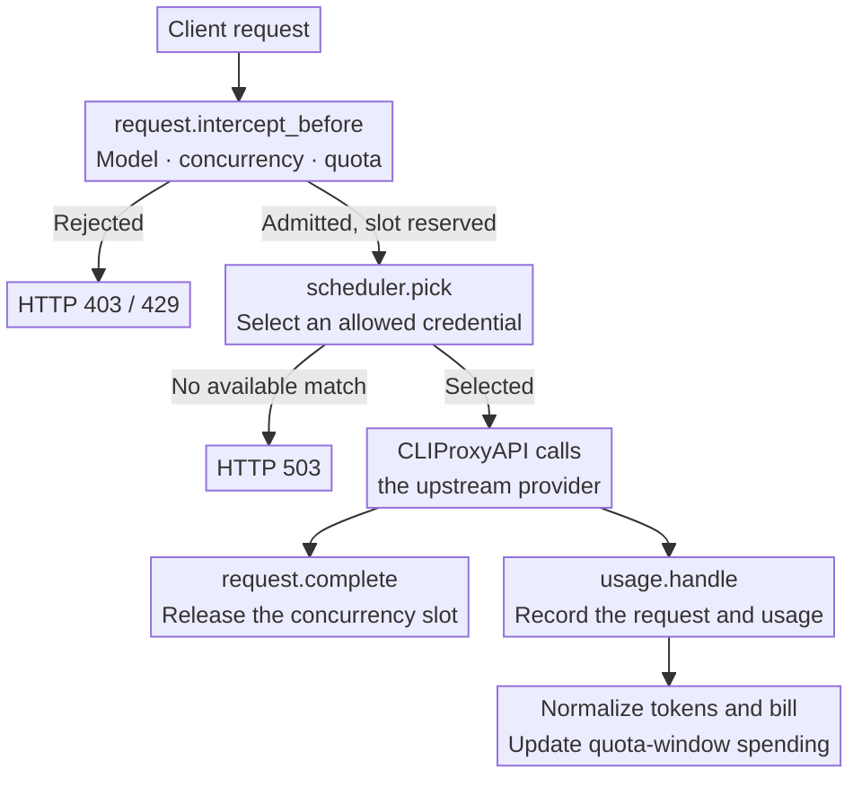
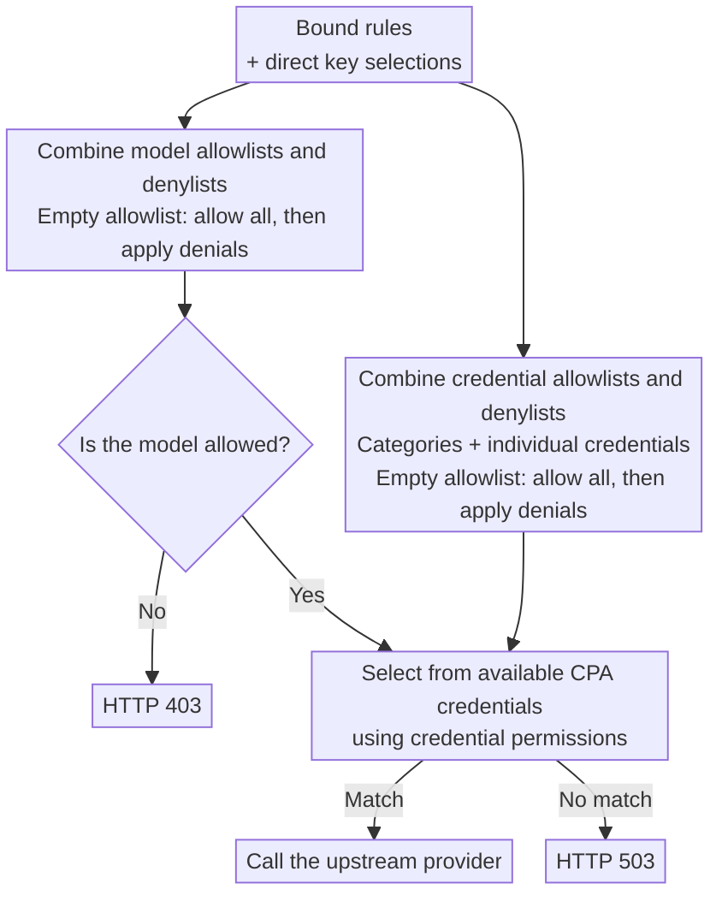

<div align="center">
  <h1>CPA Key Billing</h1>
  <p><strong>Per-key billing, subscription quotas, and routing for <a href="https://github.com/router-for-me/CLIProxyAPI">CLIProxyAPI</a>.</strong></p>
  <p>
    <a href="https://github.com/haowang02/cpa-plugin-key-billing/releases/latest"></a>
    <a href="https://github.com/haowang02/cpa-plugin-key-billing/actions/workflows/check.yml"></a>
    
    <a href="./LICENSE"></a>
  </p>
  <p><strong>English</strong> · <a href="./README.md">简体中文</a></p>
</div>


## Features

- Set spending, token, and request quotas for each API key, with independent, shared, or upstream Codex / Claude reset schedules.
- Apply separate rates to requests that exceed a long-context input threshold.
- Limit concurrent requests per API key.
- Control access to models and upstream credentials with routing rules.
- Use model reference prices from [models.dev](https://models.dev/), with optional custom overrides.

## How it works

Before a request reaches an upstream provider, the plugin checks subscription quotas, concurrency, and routing. After execution, CLIProxyAPI supplies usage through `usage.handle`. The plugin uses that record to store the request event, calculate its cost, and update spending for the current quota window.



## Requirements

- CLIProxyAPI **7.2.143 or later**.
- A CLIProxyAPI build with plugin support. Builds labeled `no-plugin` cannot load this plugin.

## Installation

Run the installer from your CLIProxyAPI directory.

On macOS or Linux:

```sh
curl -LsSf https://raw.githubusercontent.com/haowang02/cpa-plugin-key-billing/main/install.sh | sh
```

On Windows, stop CLIProxyAPI first, then run this in PowerShell:

```powershell
irm https://raw.githubusercontent.com/haowang02/cpa-plugin-key-billing/main/install.ps1 | iex
```

The installer places the plugin in `plugins/` under the current directory. Restart CLIProxyAPI after installing or upgrading.

For manual installation, download the archive for your platform from [Releases](https://github.com/haowang02/cpa-plugin-key-billing/releases/latest), then extract the library into CLIProxyAPI’s `plugins/` directory:

```text
plugins/cpa-key-billing.so       # Linux
plugins/cpa-key-billing.dylib    # macOS
plugins/cpa-key-billing.dll      # Windows
```

## Configuration

Add the following to your CLIProxyAPI configuration:

```yaml
plugins:
  enabled: true
  dir: "plugins"
  configs:
    cpa-key-billing:
      enabled: true
      debug: false # Include routing and reference-price matching in debug logs
      codex_fast_mode_billing: false # Charge 2.5× for Codex priority requests
      mask_api_key_view_emails: false # Mask email addresses in API key account views
      pause_reset_follow_sync: false # Pause the 30-minute schedule; set true before disabling the plugin
      allow_api_key_quota_reset: false # Allow API key users to reset accessible Codex auth file quotas using upstream reset credits
      state_file: "plugins/cpa-key-billing-state-v1.db"
```

> [!WARNING]
> Back up your data file before upgrading.
>
> - Databases created by v1.0.0 or later are migrated automatically.
> - JSON and SQLite files from v0.8.4 or earlier cannot be migrated. Point `state_file` to a new file instead.

Restart CLIProxyAPI and open **API Key Billing** in the management panel. Review model pricing, create subscription plans, and bind the API keys whose quotas you want to enforce.

## Access

Administrators can open the plugin from the management panel or visit it directly:

```text
http(s)://<CLIProxyAPI address>/v0/resource/plugins/cpa-key-billing/ui
```

API key holders can use their own key to view their subscription and usage:

```text
http(s)://<CLIProxyAPI address>/v0/resource/plugins/cpa-key-billing/ui#account
```

## Billing and quotas

- Keys without a subscription plan still have their usage recorded, but have no subscription quota limit.
- A plan can contain multiple quota windows. Each window can limit spending in USD, tokens, requests, or any combination of the three.
- Usage is tracked separately for each key, even when keys share a plan. Independent cycles start when the first request is admitted. Shared cycles use the configured schedule for every bound key.
- A manual quota reset keeps shared reset times unchanged. Independent cycles restart when the next request is admitted.
- Custom model prices take precedence over models.dev reference prices. Requests are rejected if neither is available.
- Request events are retained for 365 days.

## Following upstream resets

Choose **Follow upstream resets** on the API key page and select a Codex or Claude account allowed by that key's routing rules. Every subscription window must match exactly one ordinary upstream window with a valid future reset time. Claude supports 5-hour and 7-day windows; Codex uses explicitly reported durations. Code review and model-specific allowances are excluded. Enabling, switching, and disabling preserve current usage. Subscription and routing edits revalidate compatibility; disable following before unbinding a subscription.

Each key keeps independent accounting; upstream percentages never determine its charges. Synchronization runs when following is enabled or switched, when the API key or subscription page is loaded or refreshed, and when account quota is explicitly queried. The plugin also synchronizes automatically every 30 minutes, including when pages are closed and no requests arrive. Restarting or resuming the plugin synchronizes saved followers as soon as CPA has loaded its auth files. Each round queries a shared account once; rounds never overlap, and slow rounds finish before the next 30-minute wait begins. Admission and quota reads apply each confirmed boundary once. A failed query preserves limits and usage. After consuming a known boundary, usage accumulates until a new valid time is available; recovery does not erase that usage. Successful Codex resets performed in this plugin immediately reset all following keys. Operation IDs are persisted to prevent duplicate resets, and refresh failures are reported separately from reset success.

Quota queries, reset-follow synchronization, and manual Codex resets honor the auth file’s proxy setting: HTTP, HTTPS, SOCKS5, SOCKS5H, or explicit `direct` / `none`. Without an account override, requests continue through the host’s global proxy. Account proxy requests complete synchronously with a 30-second per-request timeout. A proxy failure never falls back to a direct connection or clears recorded usage.

The feature is off by default. Existing keys retain their schedules. SQLite migrates to format 18 while preserving historical events and cycles. A reconfiguration that only changes plugin settings, including any CPA configuration save, applies immediately: it neither waits for an in-flight upstream query nor blocks requests, and the worker reads the new settings before querying the next account. Switching the data file, `plugin.quiesce`, and shutdown stop and join the worker and wait for in-flight plugin requests before switching or closing storage; meanwhile, page refreshes stop after the account being queried. The host HTTP callback has no plugin-supplied cancellation or timeout, so issued calls are allowed to finish instead of being abandoned; if the upstream never answers, these three operations wait for that call. Administrators can use `PUT /v0/management/plugins/cpa-key-billing/keys/reset-follow` with `{"scope":"<key identifier>","auth_index":"<host account identifier>"}`; an empty `auth_index` disables following.

The pages request synchronization with `GET /keys?refresh_reset_follow=1` or the account endpoint `GET /subscription?refresh_reset_follow=1`. Without this parameter, these endpoints only read saved state and check confirmed boundaries. Each administrator refresh queries a shared account once; account users refresh only their own followed account, subject to routing permissions. A failed synchronization still returns the quota view with the error in its follow status.

**Before disabling the plugin:** CPA v7.2.143 and v7.3.15 do not notify plugins when their enable switch is turned off. Save `pause_reset_follow_sync: true` in the plugin settings first, or turn off following for every key. Turning off only the CPA plugin switch may leave automatic synchronization running. Pausing takes effect at once, even while an upstream query hangs: once the issued query ends, no further account is queried. Pausing preserves follower settings and usage and still permits explicit page refreshes. Setting the option back to `false` synchronizes immediately and resumes the 30-minute schedule; if an earlier query is still running, that synchronization follows it rather than running concurrently. If host process exit interrupts a query, the last confirmed boundaries and persisted usage remain available.

## Routing rules

Bind routing rules on the API key page, or set model and credential permissions directly on a key. Each selection cycles through three states: unselected, allowed (check mark), and denied (cross).

A credential-category selection covers all credentials in that category, including credentials added later. You can deny individual credentials within an allowed category.

The plugin combines all bound rules with the key’s direct selections. Model and credential permissions are evaluated separately: allowlists are combined, denylists are combined, and denials take precedence. An empty allowlist permits everything that is not explicitly denied.



## Rejection responses

| Condition | HTTP status | `type` | `code` |
| --- | --- | --- | --- |
| Concurrency limit reached | `429` | `rate_limit_error` | `rate_limit_exceeded` |
| Subscription quota exhausted | `429` | `rate_limit_error` | `rate_limit_exceeded` |
| Model access denied | `403` | `permission_error` | `insufficient_quota` |
| No available credential matches the routing rules | `503` | `server_error` | `internal_server_error` |
| A bound routing rule is missing or invalid | `503` | `server_error` | `routing_configuration_error` |
| Model has no price | `503` | `cpa_key_billing_error` | `model_price_error` |

## Acknowledgments

- [LINUX DO](https://linux.do/) community.
