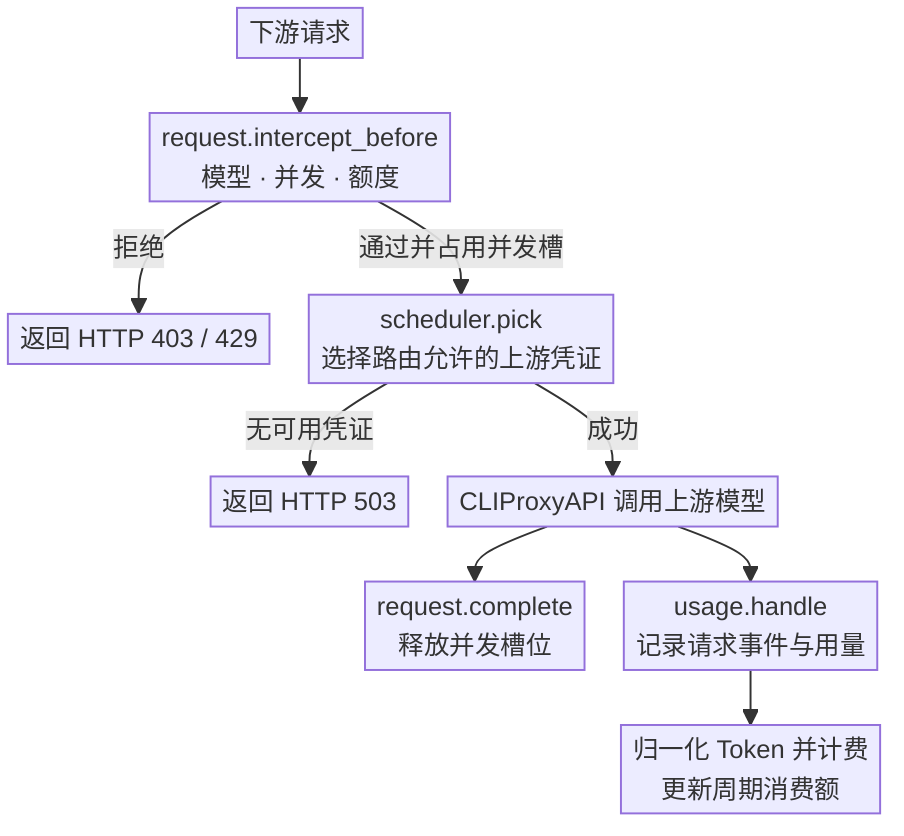
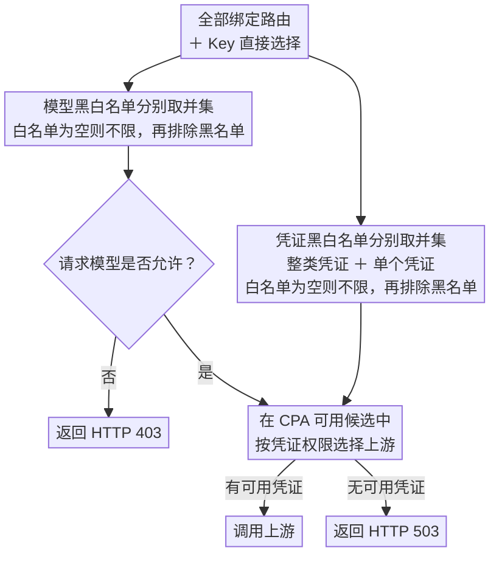

<div align="center">
  <h1>CPA Key Billing</h1>
  <p><strong><a href="https://github.com/router-for-me/CLIProxyAPI">CLIProxyAPI</a> 下游 API Key 计费与订阅额度插件。</strong></p>
  <p>
    <a href="https://github.com/haowang02/cpa-plugin-key-billing/releases/latest"></a>
    <a href="https://github.com/haowang02/cpa-plugin-key-billing/actions/workflows/check.yml"></a>
    
    <a href="./LICENSE"></a>
  </p>
  <p><a href="./README.en.md">English</a> · <strong>简体中文</strong></p>
</div>


## 功能特性

- 支持金额、Token、请求三种额度，可按 API Key 独立计时、按订阅计划统一周期重置，或跟随 Codex / Claude 上游账号重置
- 支持按输入 Token 阈值切换长上下文**阶梯计价**
- 支持按 API Key 设置**最大并发请求数**
- 支持为每个 API Key 绑定**路由规则**，限制模型访问范围和上游凭证
- 可从 [models.dev](https://models.dev/) 获取模型参考价

## 工作原理

插件会在请求到达上游前检查订阅额度、并发和路由。上游调用结束后，CLIProxyAPI 通过 `usage.handle` 提供用量。插件据此记录请求事件、计算费用并更新周期消费额。



## 环境要求

- CLIProxyAPI `7.2.143` 或更高版本，建议使用最新版本
- 使用支持插件的 CLIProxyAPI 构建，不要使用 no-plugin 版本

## 安装

在 CLIProxyAPI 根目录运行。macOS 和 Linux 使用：

```sh
curl -LsSf https://raw.githubusercontent.com/haowang02/cpa-plugin-key-billing/main/install.sh | sh
```

Windows 请先停止 CLIProxyAPI，再在 PowerShell 中运行：

```powershell
irm https://raw.githubusercontent.com/haowang02/cpa-plugin-key-billing/main/install.ps1 | iex
```

安装脚本会将插件安装到当前目录的 `plugins/`。安装或升级完成后需要重启 CLIProxyAPI。

也可以从 [Releases](../../releases/latest) 下载对应平台的发布包，解压后将动态库放入 CLIProxyAPI 的 `plugins/` 目录：

```text
plugins/cpa-key-billing.so       # Linux
plugins/cpa-key-billing.dylib    # macOS
plugins/cpa-key-billing.dll      # Windows
```

## 配置

在 CLIProxyAPI 配置文件中加入：

```yaml
plugins:
  enabled: true
  dir: "plugins"
  configs:
    cpa-key-billing:
      enabled: true
      debug: false # 是否记录 debug 日志，例如路由日志、匹配参考价日志
      codex_fast_mode_billing: false # 开启后，Codex 的 priority 请求按 2.5 倍计费
      mask_api_key_view_emails: false # 对 API Key 查询页面返回的邮箱进行掩码脱敏
      pause_reset_follow_sync: false # 暂停每 30 分钟自动同步；停用插件前先设为 true
      allow_api_key_quota_reset: false # 允许 API Key 用户重置可访问的 Codex 认证文件额度，消耗上游重置次数
      state_file: "plugins/cpa-key-billing-state-v1.db"
```

> [!WARNING]
> 升级前请备份数据文件。
>
> - v1.0.0 至最新版本的数据库文件支持自动迁移。
> - v0.8.4 及更早版本的 JSON 或 SQLite 数据文件不支持迁移，请将 `state_file` 指向新文件。

重启 CLIProxyAPI 后，在管理中心打开「API Key Billing」。确认模型定价后，创建订阅计划并绑定需要限制的 API Key。

## 页面访问

管理员可以从 CLIProxyAPI 管理中心的「API Key Billing」菜单进入，也可以直接打开：

```text
http(s)://<CLIProxyAPI 地址>/v0/resource/plugins/cpa-key-billing/ui
```

普通用户使用自己的 API Key 查询订阅额度和用量时，直接打开：

```text
http(s)://<CLIProxyAPI 地址>/v0/resource/plugins/cpa-key-billing/ui#account
```

## 计费与订阅规则

- 未绑定订阅计划的 API Key 只统计用量，不限制额度。
- 订阅计划可设置多个自定义额度窗口，每个窗口可单独或组合限制金额、Token、请求数。
- 每个 API Key 独立记账。独立周期从首次放行开始；统一周期可为各窗口指定下次开始时间，所有绑定 Key 按固定时间重置。
- 手动重置额度时，统一周期的重置时间保持不变；独立周期在下一次放行时重新开始。
- 自定义价优先于 models.dev 参考价，两者都没有时拒绝新请求。
- 已有匹配参考价的请求直接放行，不等待下载，即使参考价已超过 24 小时。超过 24 小时的参考价在 CPA 保存配置或重启时同步，也可在管理中心手动更新；请求的模型没有匹配价格时也会同步，每小时最多一次，失败后退避重试。
- 请求事件保留最近 365 天。

## 跟随上游重置

在 API Key 页点击“跟随重置”，选择路由允许访问的 Codex 或 Claude 账号。全部订阅窗口都必须唯一匹配上游普通额度窗口，并具有有效的下次重置时间；Claude 支持 5 小时和 7 天，Codex 使用上游明确返回的窗口时长。代码审查、模型专属等附加额度不参与匹配。开启、切换或关闭时保留已用额度，关闭后已用额度最多保留到该周期从开始算起满一个计划时长，已超过的周期在下次放行时重新开始；修改订阅或路由时会重新校验兼容性，解除订阅前需先关闭跟随。校验不要求先刷新：只改名称或额度不影响跟随，已确认的边界保持不变；新增或调整时长的窗口沿用最近一次同步到的同时长上游窗口，其重置时间已过期时等待下一次同步。无法兼容时拒绝修改并指明 Key。已从 CPA 删除的 Key 无法管理，遇到不兼容的修改时自动停止跟随，保留已用额度，不再阻止修改。

各 Key 独立记账，上游百分比不参与扣费。开启或切换跟随时同步，加载或刷新 API Key 页、用户订阅页，以及手动查询账号额度时更新同步状态。插件内置每 30 分钟自动同步，关闭页面、没有请求流量时仍会同步。重启或恢复插件后，在 CPA 加载认证文件后立即同步已配置的跟随账号；每轮同一账号只查询一次，轮次不重叠，慢查询完成后等待完整的 30 分钟再运行。已确认的边界在放行请求和查询额度时立即检查，且只执行一次。同步失败时保留限制，已知边界用完后继续累计，等待新的有效时间；恢复同步不会清除等待期间的用量。本插件内成功执行 Codex 手动重置会联动全部跟随 Key，并将成功的操作 ID 保留 7 天，防止重试时重复清零；上游未确认的重置不留记录，可用同一 ID 重试。API Key 用户对同一账号每分钟最多发起一次新的重置，重试已成功的重置不受此限制；刷新失败单独报告。

认证文件设置了独立代理时，额度查询、跟随同步和 Codex 手动重置均使用该代理，支持 HTTP、HTTPS、SOCKS5、SOCKS5H，以及 `direct` / `none` 显式直连。未设置独立代理时沿用宿主的全局代理。代理请求同步完成，单次请求最多等待 30 秒；代理失败不会回退直连，也不会清空已用额度。

功能默认关闭，旧 Key 保持原有行为。数据库自动迁移至格式 18，保留历史事件和周期。只修改插件设置的重配置（包括保存 CPA 任意配置）立即生效，不等待正在进行的上游查询，也不阻塞请求；定时任务在查询下一个账号前读取新设置。切换数据文件、`plugin.quiesce` 和关闭调用会停止定时任务并等待正在处理的同步和插件请求，再切换或关闭存储；等待期间页面刷新在当前账号查询完成后停止。宿主 HTTP 回调不支持插件设置取消或超时，因此等待已发出的调用返回，不遗留后台请求；上游一直无响应时，这三类操作会等到该调用结束。管理员接口为 `PUT /v0/management/plugins/cpa-key-billing/keys/reset-follow`，请求体为 `{"scope":"<Key 标识>","auth_index":"<宿主账号标识>"}`；空 `auth_index` 表示关闭。

页面使用 `GET /keys?refresh_reset_follow=1` 或用户侧 `GET /subscription?refresh_reset_follow=1` 同步；不带该参数时仅读取已保存状态和检查边界。管理员刷新同一账号每次只查询一次，用户刷新仅查询自己跟随且路由允许的账号。API Key 用户触发的上游查询（订阅页刷新和账号额度查询）对同一账号 1 分钟内最多一次，期间复用最近一次结果，包括失败；管理员查询、开启跟随、手动重置后的刷新和定时同步不受此限制，并会更新该结果。同步失败仍返回额度视图，并在跟随状态中显示异常。

**停用注意：CPA v7.2.143 和 v7.3.15 的停用开关不会通知插件。停用前请先在插件配置中设置 `pause_reset_follow_sync: true` 并保存，或取消全部 Key 的跟随；只关闭 CPA 的插件开关可能继续定时同步。** 暂停立即生效，即使上游查询无响应也不等待：已发出的查询结束后不再查询其他账号。暂停只停止自动同步，不清除跟随配置和用量，页面仍可手动刷新；恢复为 `false` 后立即同步并恢复每 30 分钟调度，若之前的查询仍未结束，则在其结束后同步，不会并发查询。宿主进程退出若中断查询，保留最后确认的边界和已持久化用量。

## 路由规则

在 API Key 页面绑定路由规则，也可直接选择模型、整类凭证或单个凭证。点击模型或凭证的选框，可在未选择、白名单（勾号）、黑名单（叉号）之间切换。整类凭证包含该类别后续新增的凭证，也可用黑名单排除其中的单个凭证。模型与凭证分别合并所有绑定规则和直接选择：白名单取并集，黑名单取并集，黑名单优先。白名单为空时允许全部，再排除黑名单。



## 拦截请求的响应

| 场景 | 状态码 | `type` | `code` |
| --- | --- | --- | --- |
| API Key 并发已满 | `429` | `rate_limit_error` | `rate_limit_exceeded` |
| 订阅额度用尽 | `429` | `rate_limit_error` | `rate_limit_exceeded` |
| 模型无权访问 | `403` | `permission_error` | `insufficient_quota` |
| 没有符合规则且可用的凭证 | `503` | `server_error` | `internal_server_error` |
| 已绑定的路由规则不存在或损坏 | `503` | `server_error` | `routing_configuration_error` |
| 模型未定价 | `503` | `cpa_key_billing_error` | `model_price_error` |

## 致谢

- [LINUX DO](https://linux.do/) - 新的理想型社区
